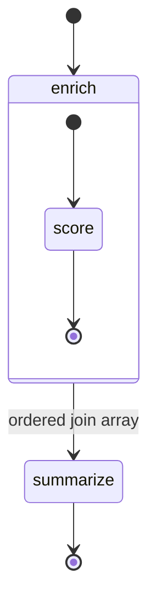

# Batch enrichment — Map fan-out

Enrich a batch of CRM leads: a **Map** state invokes the scoring function once per element of `$.leads` — at most 3 concurrently — and the ordered join array feeds a summary step.
The function stays single-record simple; the workflow owns the fan-out, throttling, retries and ordering.



## Deploy

```bash
fission environment create --name nodejs --image ghcr.io/fission/node-env-22   # once

fission function create --name wf-enrich-lead --env nodejs --code functions/enrich-lead.js
fission function create --name wf-summarize-leads --env nodejs --code functions/summarize-leads.js

fission workflow create -f workflow.yaml
```

## Run

```bash
fission workflow run --name batch-enrichment --input @inputs/leads.json
fission workflow runs describe --name <run-name>
```

The final output is the campaign summary:

```json
{"total": 6, "bySegment": {"hot": 3, "warm": 1, "cold": 2}, "hotLeads": ["cto@acme-robotics.com", ...]}
```

`fission workflow runs history --name <run-name>` shows one `StepScheduled`/`StepSucceeded` pair per lead (branch keys `0`..`5`) and a `BranchesJoined` event carrying the ordered results.

## Why a workflow and not a loop in one function?

- **Durability** — a controller restart mid-batch resumes exactly where it left off; already-enriched leads are not re-processed.
- **Throttling** — `maxConcurrency: 3` bounds pressure on the (real-world) enrichment API without any queueing code.
- **Per-item retries** — a transient failure on one lead retries that lead only, not the whole batch.
