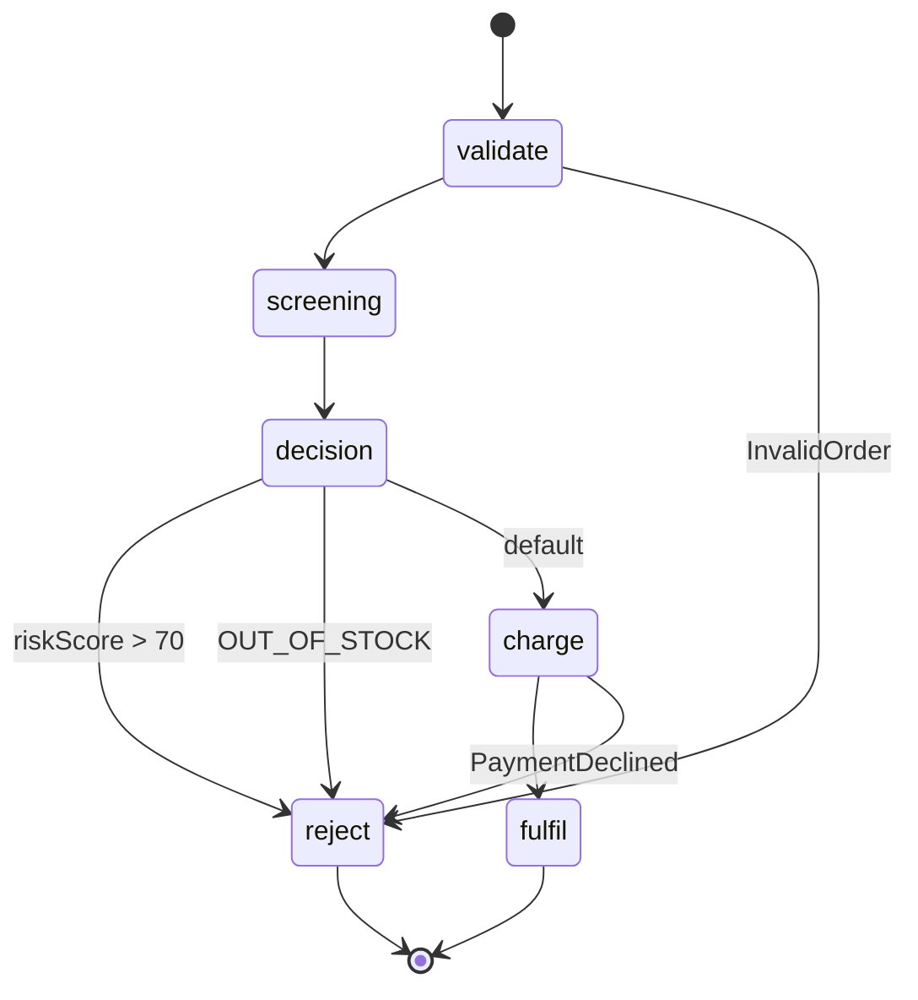

# Order pipeline — checkout orchestration

The flagship workflow example: an e-commerce checkout that validates an order, screens it for fraud and stock **in parallel**, routes on the results, charges the card **with retry and a catch for declines**, and converges every failure onto a single rejection path.



## Deploy

```bash
fission environment create --name nodejs --image ghcr.io/fission/node-env-22   # once

for fn in validate-order fraud-score inventory-check charge-card fulfil-order reject-order; do
  fission function create --name wf-$fn --env nodejs --code functions/$fn.js
done

fission workflow create -f workflow.yaml
```

## Run every path

Each sample input deterministically exercises one route:

| Input | What happens |
|---|---|
| `inputs/happy.json` | validate → parallel screening → charge → **FULFILLED** |
| `inputs/flaky-gateway.json` | charge gets a 500 on attempt 1, the **retry policy** re-invokes with backoff, attempt 2 succeeds → FULFILLED (see two `StepFailed`/`StepScheduled` pairs in the history) |
| `inputs/declined-card.json` | charge returns typed `PaymentDeclined` → **catch** routes to reject (no retries burned on a decline) |
| `inputs/high-fraud.json` | fraud branch scores 100 → **Choice** routes to reject |
| `inputs/out-of-stock.json` | inventory branch reports OUT_OF_STOCK → Choice routes to reject |
| `inputs/invalid.json` | validation fails with typed `InvalidOrder` → straight to reject |

```bash
fission workflow run --name order-pipeline --input @inputs/happy.json
# workflow run 'order-pipeline-xxxxx' started

fission workflow runs describe --name order-pipeline-xxxxx
fission workflow runs history --name order-pipeline-xxxxx --io
```

The `--io` flag shows each step's input/output, including the parallel join array landing at `$.screening` and the charge receipt at `$.charge`.

## What to look at

- **`workflow.yaml`** — the whole business process in ~70 commented lines.
- **`functions/charge-card.js`** — how a payment step distinguishes *retryable* infrastructure failure (500) from a *terminal* business decline (typed 402), and how `X-Fission-Workflow-Attempt` doubles as an idempotency key.
- **`functions/reject-order.js`** — one convergence point that inspects the accumulated document to explain *why* the order was rejected.
