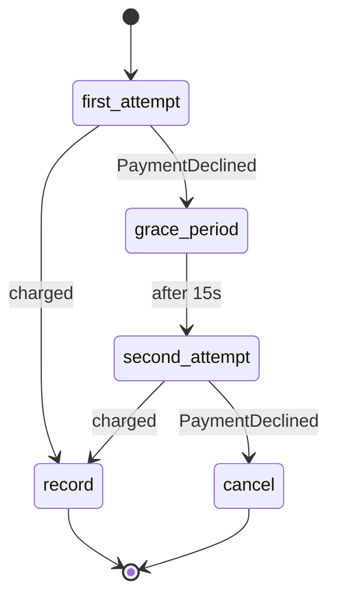

# Payment dunning — durable Wait timers

Subscription renewal with a grace period: if the charge is declined, the run **waits out a grace period on a durable timer** and tries once more before cancelling the subscription.
In production the Wait would be days (`duration: 72h`); the example uses 15 seconds so you can watch it.

The run consumes no pod, no memory and no connection while waiting — the timer lives in the statestore and survives controller restarts.



## Deploy

```bash
fission environment create --name nodejs --image ghcr.io/fission/node-env-22   # once

for fn in charge-subscription record-payment cancel-subscription; do
  fission function create --name wf-$fn --env nodejs --code functions/$fn.js
done

fission workflow create -f workflow.yaml
```

## Run

```bash
# Happy path: charged on the first attempt, run succeeds immediately.
fission workflow run --name payment-dunning --input @inputs/valid.json

# Dunning path: declined -> 15s durable wait -> declined again -> CANCELLED.
fission workflow run --name payment-dunning --input @inputs/past-due.json
fission workflow runs list --workflow payment-dunning     # phase stays Running during the wait
```

While the past-due run is in the grace period, `fission workflow runs describe --name <run-name>` shows the run parked in `grace-period`.
The history afterwards shows the `TimerFired` event between the two attempts:

```bash
fission workflow runs history --name <run-name>
```

To prove the wait is durable, restart the engine mid-wait — the run still completes:

```bash
kubectl rollout restart deployment/workflow -n fission
```
